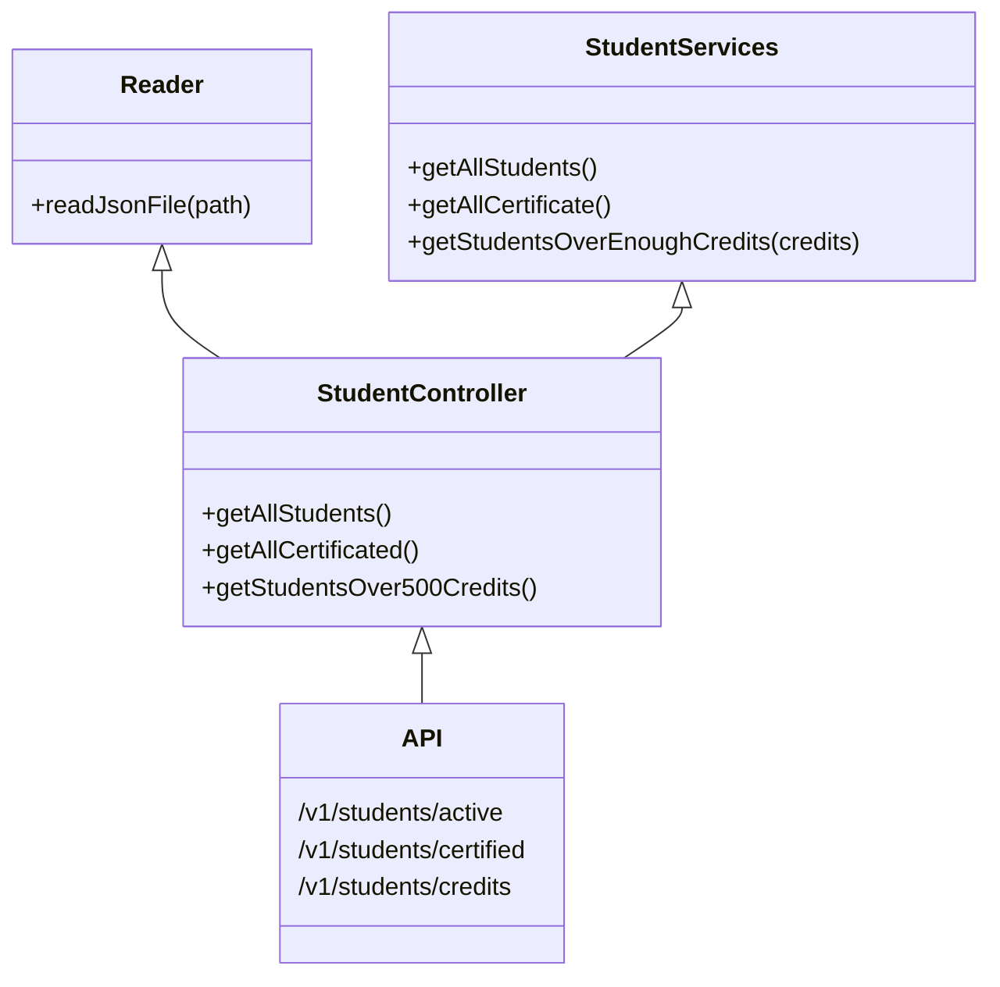

# Visual Thining API

Tiempo dedicado: 1:27

## Dependencias

| Dependencias | Usadas para        |
| :----------: | ------------------ |
|     Jest     | Pruebas de unidad  |
|   Express    | Configurar la API  |
|    ESLint    | Formateo de codigo |

## Diseño de componentes

## API

| Endpoint                               | Response                                        |
| -------------------------------------- | ----------------------------------------------- |
| `localhost:3000/v1/students`           | Retorna la lista de todos los estudiantes       |
| `localhost:3000/v1/students/certified` | Retorna los estudiantes certificados            |
| `localhost:3000/v1/students/credits`   | Retorna los estudiantes con mas de 500 creditos |
